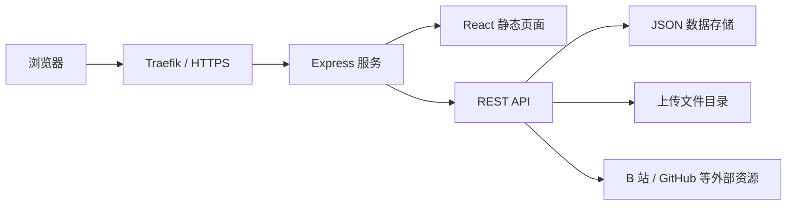
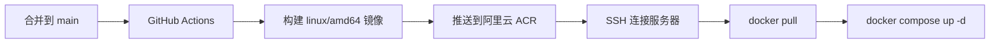

# DHU AILAB HomePage

东华大学人工智能创新实验室网站。项目包含公开网站、内容管理后台、成员账号与个人中心、文件上传、图片处理和自动部署流程。

本项目已经完全自托管，不依赖 Base44。前端、后端、数据和上传文件均运行在实验室服务器上。

## 目录

- [项目能力](#项目能力)
- [技术栈](#技术栈)
- [总体架构](#总体架构)
- [目录结构](#目录结构)
- [前端架构](#前端架构)
- [后端架构](#后端架构)
- [数据存储](#数据存储)
- [认证与权限](#认证与权限)
- [图片和文件处理](#图片和文件处理)
- [本地开发](#本地开发)
- [测试与质量检查](#测试与质量检查)
- [如何开发新功能](#如何开发新功能)
- [提交 Pull Request](#提交-pull-request)
- [Docker 与生产部署](#docker-与生产部署)
- [自动部署](#自动部署)
- [数据备份与恢复](#数据备份与恢复)
- [安全注意事项](#安全注意事项)
- [常见问题](#常见问题)

## 项目能力

公开网站目前包含：

- 首页、实验室介绍和主页图片轮播
- 团队成员、指导老师和毕业成员展示
- 成员教育及职业经历时间轴
- 科研成果、竞赛获奖、活动、通知和社团生活
- B 站视频、学习资料和 AI 入门指南
- 招新信息和常见问题
- 响应式图片、图片渐进展示和移动端适配

内容维护能力包括：

- 管理员统一维护网站内容和页面文案
- 批量导入成员账号
- 成员使用学号或工号登录个人中心
- 成员只能修改自己的公开资料
- 成员上传照片后自动公开资料
- 管理员可停用账号、重置密码或隐藏成员
- 上传图片自动优化，并保留原始文件

## 技术栈

| 层级 | 技术 | 用途 |
| --- | --- | --- |
| 前端框架 | React 18 | 页面和交互组件 |
| 构建工具 | Vite 6 | 开发服务和生产构建 |
| 路由 | React Router 6 | 前端单页路由 |
| 样式 | Tailwind CSS 3 | 设计系统和响应式布局 |
| UI 基础 | Radix UI、项目内 UI 组件 | 无障碍交互组件 |
| 动效 | Framer Motion | 页面进入、卡片和侧栏动效 |
| 图标 | Lucide React、Simple Icons | 通用图标和品牌图标 |
| 请求层 | Fetch、TanStack Query | API 请求、局部缓存和状态管理 |
| 后端 | Node.js、Express 5 | API、认证、上传和静态文件服务 |
| 文件上传 | Multer | 接收图片和资料文件 |
| 图片处理 | Sharp | 压缩、格式转换和响应式图片 |
| PDF 封面 | Poppler | 生成 PDF 第一页预览图 |
| 数据存储 | 本地 JSON 文件 | 内容、成员资料和成员账号 |
| 测试 | Node.js Test Runner | 后端数据和成员逻辑测试 |
| 容器 | Docker、Docker Compose | 构建和运行生产服务 |
| CI/CD | GitHub Actions、阿里云 ACR | 构建镜像并自动部署 |

本地开发最低需要 Node.js 18，推荐使用 Node.js 22，与 Docker 镜像保持一致。

## 总体架构

这是一个前后端同仓库、同域名部署的单体全栈应用。



运行方式分为两种：

1. 开发环境：`server/index.js --dev` 启动 Express，并把 Vite 作为中间件挂载到同一个端口。
2. 生产环境：Vite 先生成 `dist/`，Express 再提供 API、上传文件和 `dist/` 中的前端文件。

因此前端统一使用 `/api/...` 相对地址，不需要单独配置 API 域名，也不存在开发和生产跨域问题。

## 目录结构

```text
DHU-AILAB-HomePage/
├─ .github/
│  └─ workflows/
│     └─ publish-docker-image.yml  # 构建镜像并通过 SSH 部署
├─ public/                         # Logo 等不经过打包处理的静态资源
├─ src/                            # React 前端
│  ├─ api/
│  │  └─ client.js                 # 统一 API 客户端和短期列表缓存
│  ├─ components/
│  │  ├─ admin/                    # 管理后台编辑组件
│  │  ├─ members/                  # 成员资料与经历组件
│  │  ├─ motion/                   # 通用动效组件
│  │  └─ ui/                       # 项目基础 UI 组件
│  ├─ hooks/                       # React Hooks
│  ├─ lib/                         # 登录状态、排序、文案和工具函数
│  ├─ pages/                       # 路由页面
│  ├─ App.jsx                      # 路由、Provider 和错误边界
│  ├─ index.css                    # 全局设计变量和样式
│  └─ main.jsx                     # 前端入口
├─ server/
│  ├─ index.js                     # Express、API、认证、上传和静态服务
│  ├─ store.js                     # 网站实体的 JSON 存储和校验
│  ├─ member-account-store.js      # 成员账号、密码哈希和会话版本
│  ├─ member-import.js             # 成员批量导入和幂等处理
│  ├─ member-visibility.js         # 成员是否公开的唯一判定逻辑
│  └─ optimize-uploads.js          # 历史上传图片批量优化工具
├─ tests/                          # Node.js 单元测试
├─ data/                           # 运行数据，不提交 Git
├─ Dockerfile                      # 两阶段生产镜像
├─ docker-compose.yml              # 本地或服务器容器编排示例
├─ .env.example                    # 环境变量模板
├─ vite.config.js                  # Vite 配置和 @ 路径别名
└─ package.json                    # 依赖和命令
```

## 前端架构

### 页面路由

路由定义在 `src/App.jsx`。

| 路径 | 页面 | 权限 |
| --- | --- | --- |
| `/` | 首页 | 公开 |
| `/members` | 团队成员 | 公开 |
| `/awards` | 科研成果与竞赛获奖 | 公开 |
| `/activities` | 活动 | 公开 |
| `/club-life` | 社团生活 | 公开 |
| `/videos` | B 站视频 | 公开 |
| `/resources` | 学习资料 | 公开 |
| `/ai-guide` | AI 入门指南 | 公开 |
| `/notifications` | 通知 | 公开 |
| `/join` | 加入我们 | 公开 |
| `/qa` | 常见问题 | 公开 |
| `/admin-login` | 管理员和成员统一登录 | 公开 |
| `/admin` | 内容管理后台 | 仅管理员 |
| `/member-center` | 成员个人中心 | 仅成员 |
| `/member-password` | 首次登录修改密码 | 仅成员 |

大部分公开页面使用 `React.lazy` 按路由拆分。首页保持直接加载，以减少首屏等待。

### API 客户端

所有前端请求应通过 `src/api/client.js` 发出，不建议在页面中直接编写重复的 `fetch`。

客户端负责：

- 自动发送同源 Cookie
- JSON 请求头和响应解析
- 请求超时与统一错误信息
- 实体列表 30 秒短期缓存
- 内容变更后的缓存失效
- 触发 `ailab:entity-change` 事件同步统计数据

通用实体调用示例：

```js
const items = await api.entities.Activity.list('-date', 200);
await api.entities.Activity.create(payload);
await api.entities.Activity.update(id, payload);
await api.entities.Activity.delete(id);
```

### 登录状态

`src/lib/AuthContext.jsx` 在应用启动时调用 `/api/auth/me`，并向页面提供：

- 当前用户 `user`
- 登录 `login`
- 退出 `logout`
- 成员修改密码 `changePassword`

前端的路由跳转只改善用户体验，真正的权限控制始终由后端完成。

### UI 与样式约定

- 使用 `@/` 作为 `src/` 的路径别名。
- 优先复用 `src/components/ui/`，不要在页面中重复实现按钮、输入框或弹窗。
- 品牌色、圆角、背景和文字颜色使用 `src/index.css` 中的语义变量。
- 图片使用项目的 `Image` 组件，保持原图比例并请求合适尺寸。
- 动画必须兼容 `prefers-reduced-motion`。
- 新页面需要检查桌面端和移动端，至少覆盖 375px 和 1440px 宽度。
- 不要无理由修改全局导航、Logo、页面文案或已有路由。

## 后端架构

`server/index.js` 是后端入口，目前集中处理：

- Express 应用和 HTTP 服务
- 开发环境 Vite 中间件
- 管理员与成员认证
- 实体 CRUD API
- 成员批量导入
- 图片和文件上传
- 图片响应式变体
- B 站元数据和封面转发
- GitHub、YouTube 等资源封面获取
- 生产环境静态文件和 SPA 回退

### API 分类

| API | 用途 | 权限 |
| --- | --- | --- |
| `GET /api/health` | 容器健康检查 | 公开 |
| `POST /api/auth/login` | 管理员或成员登录 | 公开 |
| `GET /api/auth/me` | 获取当前登录身份 | 已登录 |
| `POST /api/auth/change-password` | 成员修改密码 | 成员 |
| `POST /api/auth/logout` | 退出登录 | 公开 |
| `GET /api/public/members` | 获取公开成员 | 公开 |
| `GET /api/entities/:entity` | 读取实体 | 公开内容可读，成员实体会过滤 |
| `POST /api/entities/:entity` | 创建实体 | 管理员 |
| `PUT /api/entities/:entity/:id` | 更新实体 | 管理员 |
| `DELETE /api/entities/:entity/:id` | 删除实体 | 管理员 |
| `POST /api/admin/member-import` | 预览或执行成员导入 | 管理员 |
| `GET /api/member/profile` | 获取本人资料 | 成员 |
| `PUT /api/member/profile` | 修改允许本人维护的字段 | 成员 |
| `POST /api/member/photo` | 上传本人照片 | 成员 |
| `POST /api/upload` | 上传管理内容文件 | 管理员 |
| `GET /api/bilibili/preview` | 获取 B 站视频元数据 | 公开 |
| `GET /api/bilibili/cover` | 转发 B 站封面 | 公开 |
| `GET /api/resource/cover` | 获取外部资源封面 | 公开 |

### 通用实体

实体和必填字段定义在 `server/store.js` 的 `ENTITY_RULES` 中。

| 实体 | 内容 |
| --- | --- |
| `Activity` | 活动 |
| `Award` | 科研成果与竞赛获奖 |
| `ClubLife` | 社团生活图片 |
| `GuideCategory` | AI 入门资源板块 |
| `GuideCourse` | AI 入门课程或资源 |
| `GuideStage` | AI 学习路径阶段 |
| `HomeImage` | 首页轮播图片 |
| `Member` | 指导老师、在校成员和毕业成员 |
| `Notification` | 通知 |
| `QA` | 常见问题 |
| `SiteSettings` | 全站设置与页面文案 |
| `StudyMaterial` | 学习资料 |
| `VideoLink` | B 站视频 |

新增实体字段时，必须同时检查：

1. `server/store.js` 的字段校验和标准化。
2. `server/index.js` 是否需要额外处理或权限限制。
3. `src/pages/Admin.jsx` 的管理字段配置。
4. 对应公开页面的展示和空状态。
5. 是否需要补充自动化测试。

## 数据存储

项目没有使用数据库，运行数据位于 `DATA_DIR` 指向的目录中，默认是项目根目录下的 `data/`。

```text
data/
├─ site-data.json          # 网站内容和成员资料
├─ member-accounts.json    # 成员账号和密码哈希
└─ uploads/
   ├─ originals/           # 上传图片原件
   ├─ variants/            # 按需生成的响应式图片
   └─ ...                  # 优化后的图片和其他文件
```

`site-data.json` 的顶层是实体名称，每个实体对应一个数组。`store.js` 为创建和更新操作添加：

- `id`
- `created_date`
- `updated_date`

存储层使用进程内队列串行化写操作，避免同一 Node.js 进程中的并发写入互相覆盖。

需要注意：

- 当前存储只适合单实例、单进程部署。
- 不要同时启动多个会写同一 `data/` 目录的容器。
- 多实例或高并发写入场景应迁移到 PostgreSQL 等数据库。
- `data/` 已被 `.gitignore` 排除，不能通过 GitHub 备份。

### 成员公开规则

成员公开判定集中在 `server/member-visibility.js`：

- 必须已经上传照片。
- `profile_status` 不能是 `draft`。
- `profile_status` 不能是 `hidden`。

前端不能自行放宽该规则。公开接口和通用成员接口都必须复用后端过滤逻辑。

### 成员教育与职业经历

`Member.experiences` 是按展示顺序保存的数组。每项包含：

```js
{
  id: '唯一标识',
  type: 'education | work | internship | other',
  start_date: '2022-09',
  end_date: '2026-06',
  is_current: false,
  organization: '东华大学',
  role: '工学学士',
  field: '人工智能',
  description: ''
}
```

不要把经历重新拆成“保研去向”“就业单位”等互斥字段。同一个成员可能先读研、再实习、再就业，时间轴模型可以完整表达这些情况。

## 认证与权限

### 管理员

管理员账号和密码来自环境变量：

- `ADMIN_ACCOUNT`
- `ADMIN_PASSWORD`

管理员可管理所有实体、成员账号和上传文件。

### 成员

管理员新增或批量导入成员时会创建成员账号。初始密码与学号或工号相同，首次登录必须修改密码。

成员密码使用 Node.js `scrypt` 加盐哈希，原始密码不会写入数据文件。成员只能修改后端白名单允许的本人字段。

### 会话

- 会话存放在 `HttpOnly` Cookie 中。
- 会话使用 `SESSION_SECRET` 进行 HMAC-SHA256 签名。
- Cookie 默认有效 12 小时。
- `SameSite` 为 `lax`。
- 生产环境默认要求 `Secure` Cookie，因此必须通过 HTTPS 访问。
- 停用账号、重置密码或修改密码会使旧成员会话失效。
- 登录失败限制保存在进程内，服务重启后会重置。

## 图片和文件处理

### 图片上传

图片上传后：

1. 原始文件保存在 `data/uploads/originals/`。
2. Sharp 自动旋转图片并限制最长边为 2560px。
3. 优化版本保存为 WebP。
4. PNG 使用无损 WebP，照片使用质量参数为 86 的 WebP。
5. 页面按需要请求 320、640、960、1440 或 1920px 变体。

上传限制默认为 25MB。服务端会拒绝 HTML、SVG 和 XML 等可能造成脚本注入的文件类型。

### PDF

服务器安装 Poppler 时，上传 PDF 会尝试把第一页转换成 WebP 封面。转换失败不会阻止文件本身保存。

### 外部资源封面

B 站和其他外部资源的封面通过本站后端获取，避免浏览器跨域和防盗链问题。响应可被浏览器或反向代理缓存，缓存到期后会重新请求，不代表封面在到期时被删除。

## 本地开发

### 1. 获取代码

```bash
git clone https://github.com/Ceprin11/DHU-AILAB-HomePage.git
cd DHU-AILAB-HomePage
```

### 2. 安装依赖

推荐使用锁文件安装：

```bash
npm ci
```

只有在主动升级依赖时才使用 `npm install`，并在 PR 中提交更新后的 `package-lock.json`。

### 3. 配置环境变量

```bash
cp .env.example .env
```

Windows PowerShell：

```powershell
Copy-Item .env.example .env
```

开发环境可以使用单独的本地密码。不要把 `.env` 提交到 Git。

```env
NODE_ENV=development
PORT=3000
ADMIN_ACCOUNT=AILAB
ADMIN_PASSWORD=仅用于本地开发的密码
SESSION_SECRET=至少32位的本地随机字符串
DATA_DIR=data
COOKIE_SECURE=false
TRUST_PROXY=false
```

`COOKIE_SECURE=false` 仅用于本地 HTTP。生产环境必须启用 HTTPS，并使用 `COOKIE_SECURE=true`。

### 4. 启动完整开发服务

```bash
npm run dev
```

默认访问：

- 网站：`http://localhost:3000/`
- 登录：`http://localhost:3000/admin-login`
- 健康检查：`http://localhost:3000/api/health`

不要用 `npm run preview` 验证完整功能。该命令只适合查看 Vite 构建结果，不会提供 Express API、登录和上传功能。

### 5. 生产模式本地验证

```bash
npm run build
npm start
```

生产模式会校验密码和会话密钥强度。如果配置仍是默认值，服务会拒绝启动。

## 常用命令

| 命令 | 用途 |
| --- | --- |
| `npm run dev` | 启动 Express 和 Vite 开发服务 |
| `npm run build` | 构建前端到 `dist/` |
| `npm start` | 启动生产 Express 服务 |
| `npm run typecheck` | 使用 TypeScript 检查 JS/JSX 类型 |
| `npm run lint` | 运行 ESLint |
| `npm run lint:fix` | 自动修复可安全修复的 ESLint 问题 |
| `npm test` | 运行所有 Node.js 测试 |
| `npm run optimize:uploads` | 批量优化历史上传图片 |

## 测试与质量检查

提交 PR 前至少运行：

```bash
npm run typecheck
npm run lint
npm test
npm run build
```

测试目录目前覆盖：

- 成员账号创建、密码哈希、重置和停用
- 成员批量导入、重复检测和年级推导
- 成员公开状态
- 成员角色和姓名排序
- 22 级及更早成员的毕业判定
- 成员教育和职业经历校验

涉及界面修改时，还应手动检查：

- 桌面端和移动端布局
- 空数据、加载失败和保存失败状态
- 管理员与成员权限
- 图片是否保持原图比例
- 刷新深层路由是否仍能打开
- 浏览器控制台是否有错误

## 如何开发新功能

### 新增公开页面

1. 在 `src/pages/` 创建页面。
2. 在 `src/App.jsx` 使用懒加载添加路由。
3. 如需导航入口，修改 `Navbar` 和移动端导航。
4. 使用 `ContentLoading` 和 `EmptyState` 处理加载及空数据。
5. 通过 `api/client.js` 获取数据。
6. 检查生产环境 SPA 回退和刷新行为。

### 新增可管理内容

1. 在 `server/store.js` 的 `ENTITY_RULES` 注册实体或字段。
2. 增加字段类型、长度、URL 或关联关系校验。
3. 在 `src/pages/Admin.jsx` 配置管理字段。
4. 在公开页面读取和展示数据。
5. 如果不是普通 CRUD，在 `server/index.js` 增加专用 API。
6. 添加覆盖正常输入和错误输入的测试。

### 修改成员资料

成员资料涉及三套入口，必须一起检查：

1. 管理员编辑：`src/pages/Admin.jsx`
2. 成员本人编辑：`src/pages/MemberCenter.jsx`
3. 公开展示：`src/pages/Members.jsx`

如果成员本人需要修改新字段，还必须加入 `server/index.js` 中的成员自助编辑白名单，并在 `server/store.js` 校验。

### 修改上传逻辑

上传逻辑集中在 `server/index.js`。修改时要同时考虑：

- MIME 类型和扩展名
- 文件大小
- 路径遍历
- 图片方向和尺寸
- 原始文件是否需要保留
- Docker 中是否安装所需系统工具
- 旧文件和新文件是否兼容

## 提交 Pull Request

### 推荐流程

```bash
git switch main
git pull --ff-only origin main
git switch -c feat/short-description
```

完成开发后：

```bash
npm run typecheck
npm run lint
npm test
npm run build
git add <本次修改的文件>
git commit -m "feat: describe the change"
git push -u origin feat/short-description
```

然后在 GitHub 创建 Pull Request，目标分支选择 `main`。

### 分支命名建议

- `feat/...`：新功能
- `fix/...`：错误修复
- `docs/...`：文档
- `refactor/...`：不改变功能的重构
- `perf/...`：性能优化
- `test/...`：测试

### Commit 建议

- `feat: add member timeline`
- `fix: preserve image aspect ratio`
- `docs: expand contribution guide`
- `refactor: share resource card logic`
- `test: cover member import conflicts`

### PR 描述必须包含

- 为什么需要修改
- 修改了哪些页面、API 或数据字段
- 如何验证
- 是否影响现有数据
- 是否需要新增环境变量
- 界面改动的桌面端和移动端截图
- 已知限制和后续工作

### PR 检查清单

- [ ] 改动范围与 PR 目标一致
- [ ] 没有提交 `.env`、`data/`、日志或临时文件
- [ ] 没有提交真实账号、密码、密钥或服务器私钥
- [ ] 没有覆盖其他维护者的无关改动
- [ ] API 权限在后端验证，而不只是前端隐藏按钮
- [ ] 数据结构有校验，并考虑旧数据兼容
- [ ] 图片保持原始比例并使用合理尺寸
- [ ] 已检查移动端和无障碍状态
- [ ] 类型检查、Lint、测试和构建全部通过
- [ ] 文档与实际行为一致

### 不应提交的内容

- `data/` 和真实上传文件
- `.env` 和任何生产密码
- `node_modules/`、`dist/`、日志和编辑器缓存
- 仅用于演示的路由、账号或测试数据
- 与 PR 无关的大范围格式化

## Docker 与生产部署

### 镜像结构

`Dockerfile` 使用两阶段构建：

1. `build` 阶段安装依赖、构建 React，并移除开发依赖。
2. `runner` 阶段复制后端、`dist/` 和生产依赖。

运行镜像基于 Node.js 22 Alpine，并安装 Poppler 以生成 PDF 封面。

容器内部端口为 `3000`，健康检查访问 `/api/health`。

### 本地 Docker 验证

```bash
docker compose build
docker compose up -d
docker compose logs -f ailab-homepage
```

当前 Compose 示例把宿主机端口 `3001` 映射到容器端口 `3000`：

```text
http://localhost:3001
```

生产数据必须挂载：

```yaml
volumes:
  - ./data:/app/data
```

删除容器不会删除这个宿主机目录。删除或覆盖宿主机 `data/` 会丢失网站内容、账号和上传文件。

### 服务器部署关系

正式环境由 Traefik 负责：

- 域名路由
- HTTPS 证书
- 将请求转发到网站容器

Traefik 的完整生产配置不在本仓库中。修改 Compose 时不要删除服务器现有的 Traefik 标签、网络、环境变量和数据挂载。

## 自动部署

`.github/workflows/publish-docker-image.yml` 在 `main` 收到提交时执行：



镜像会同时生成两个标签：

- `latest`
- `sha-<完整 Git commit SHA>`

GitHub 仓库需要配置以下 Actions Secrets：

- `ALIYUN_REGISTRY_USERNAME`
- `ALIYUN_REGISTRY_PASSWORD`
- `ALIYUN_REGISTRY_HOST`
- `SERVER_HOST`
- `SERVER_USER`
- `SERVER_SSH_KEY`

### 回滚

每次构建都保留 SHA 镜像标签。需要回滚时，把服务器 Compose 中的镜像临时改为对应的 `sha-...` 标签，然后执行：

```bash
docker compose pull ailab-homepage
docker compose up -d ailab-homepage
docker compose ps
```

代码回滚和数据回滚是两件不同的事情。旧镜像不会恢复已经被修改的 `data/`，数据必须从备份恢复。

## 数据备份与恢复

最低备份范围是整个服务器 `data/` 目录：

- `site-data.json`
- `member-accounts.json`
- `uploads/`

推荐：

- 每天自动备份一次。
- 保留至少 7 份日备份和 4 份周备份。
- 备份文件存放到另一台机器或对象存储。
- 定期执行恢复演练，不要只确认备份任务显示成功。
- 修改数据结构或批量导入前手动创建一次快照。

恢复时应先停止网站写入，再完整替换 `data/`，检查文件权限后重新启动容器。

## 安全注意事项

- GitHub 私有仓库不是密码管理器。
- `.env`、Compose 和工作流中不得出现真实密码、Registry 密码或 SSH 私钥。
- 生产 `ADMIN_PASSWORD` 至少 12 位，并使用独立随机密码。
- `SESSION_SECRET` 至少 32 个随机字符，不能与管理员密码相同。
- 如果任何密钥曾经提交到 Git，即使之后删除文件，也必须立即轮换该密钥。
- 生产环境必须使用 HTTPS 和 `COOKIE_SECURE=true`。
- 服务器设置 `TRUST_PROXY=true` 时，必须确保应用只接受可信反向代理的流量。
- 不要公开 `data/member-accounts.json` 或备份文件。
- 合并依赖升级 PR 前检查安全公告和破坏性变更。
- 管理员账号不应与成员共享。

## 常见问题

### 页面可以打开，但 API 返回 404

请使用 `npm run dev` 启动完整服务。单独启动 Vite 或使用静态文件服务器不会提供 Express API。

### 本地登录后立即退出或无法保持登录

本地 HTTP 环境应设置：

```env
COOKIE_SECURE=false
NODE_ENV=development
```

生产环境不要使用这组设置。

### 生产环境刷新子页面后白屏或 404

所有请求必须转发给 Express。Express 会把未知的 GET 路径回退到 `dist/index.html`。如果反向代理直接提供 `dist/`，需要额外配置 SPA fallback。

### 上传后重建容器，图片消失

检查服务器是否仍挂载 `./data:/app/data`，以及宿主机目录权限是否允许容器写入。

### 成员已经导入，但公开页面看不到

成员只有上传照片后才会公开。还要确认其状态不是 `draft` 或 `hidden`。

### PDF 没有生成封面

确认运行环境已经安装 `pdftoppm`。官方 Docker 镜像通过 `poppler-utils` 提供该命令。

### B 站封面暂时无法显示

先检查服务器能否访问 B 站 API 和图片域名。本站后端负责获取并缓存封面，外部服务不可用时可能暂时失败。

### JSON 数据适合长期使用吗

当前规模和单管理员场景可以使用。出现以下情况时应迁移数据库：

- 多个容器同时运行
- 多个管理员高频并发编辑
- 需要复杂搜索、审计记录或事务
- 内容量增长到频繁读取和写入完整 JSON 明显变慢

推荐迁移目标为 PostgreSQL，并保留现有 API 契约，减少前端改动。

## 维护原则

1. 保持公开页面简洁、统一，并优先保证内容可读性。
2. 权限、数据校验和公开规则必须由后端负责。
3. 数据结构修改必须兼容已有 `site-data.json`。
4. `data/` 是生产状态，Git 仓库只是程序源代码。
5. 小步提交，避免把前端重设计、后端重构和数据迁移混在一个 PR 中。
6. 合并到 `main` 会触发正式部署，合并前必须完成检查和评审。
