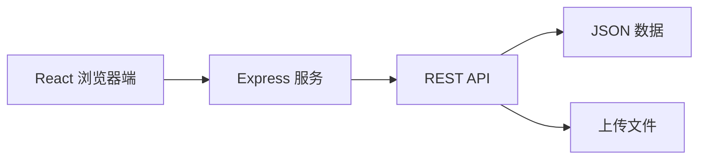

# DHU AILAB HomePage

东华大学人工智能创新实验室网站。本说明面向项目维护者和 Pull Request 贡献者。

## 技术栈

| 模块 | 技术 |
| --- | --- |
| 前端 | React 18、Vite 6、React Router 6 |
| 样式与组件 | Tailwind CSS 3、Radix UI、Framer Motion |
| 后端 | Node.js、Express 5 |
| 数据 | 本地 JSON 文件 |
| 上传处理 | Multer、Sharp、Poppler |
| 测试 | Node.js Test Runner、ESLint、TypeScript Check |
| 部署 | Docker、Docker Compose、GitHub Actions |

开发环境使用 Node.js 22 可与 Docker 镜像保持一致，最低要求 Node.js 18。

## 项目架构

这是一个前后端同仓库、同域名运行的单体全栈应用。



- 开发环境：Express 挂载 Vite 中间件，由 `npm run dev` 启动完整应用。
- 生产环境：Vite 构建到 `dist/`，Express 同时提供前端文件、API 和上传文件。
- 前端统一使用 `/api/...` 相对路径访问后端。
- 运行数据位于 `data/`，不提交 Git。

## 目录结构

```text
DHU-AILAB-HomePage/
├─ src/
│  ├─ api/client.js                 # 前端 API 客户端
│  ├─ components/
│  │  ├─ admin/                     # 管理后台组件
│  │  ├─ members/                   # 成员资料组件
│  │  ├─ motion/                    # 通用动效
│  │  └─ ui/                        # 基础 UI 组件
│  ├─ hooks/                        # React Hooks
│  ├─ lib/                          # 登录、排序、文案和工具函数
│  ├─ pages/                        # 页面组件
│  ├─ App.jsx                       # 路由与全局 Provider
│  └─ index.css                     # 全局样式和设计变量
├─ server/
│  ├─ index.js                      # API、认证、上传和静态服务
│  ├─ store.js                      # 内容存储与数据校验
│  ├─ member-account-store.js       # 成员账号与密码
│  ├─ member-import.js              # 成员批量导入
│  └─ member-visibility.js          # 成员公开规则
├─ tests/                           # 自动化测试
├─ public/                          # 公共静态资源
├─ data/                            # 运行数据，不提交 Git
├─ Dockerfile                       # 生产镜像
├─ docker-compose.yml               # 容器编排
└─ .github/workflows/               # 自动构建与部署
```

## 前端

### 路由

路由定义在 `src/App.jsx`。

| 路径 | 页面 | 权限 |
| --- | --- | --- |
| `/` | 首页 | 公开 |
| `/members` | 团队成员 | 公开 |
| `/awards` | 科研成果与竞赛获奖 | 公开 |
| `/activities` | 活动 | 公开 |
| `/club-life` | 社团生活 | 公开 |
| `/gallery` | 实验室公共相册与主页照片精选 | 已登录账号 |
| `/contribute/material` | 学习资料上传 | 已登录账号 |
| `/contribute/qa` | 问答补充 | 已登录账号 |
| `/contribute/award` | 竞赛与科研成果上传 | 已登录账号 |
| `/videos` | 视频 | 公开 |
| `/resources` | 学习资料 | 公开 |
| `/ai-guide` | AI 入门指南 | 公开 |
| `/notifications` | 通知 | 公开 |
| `/join` | 加入我们 | 公开 |
| `/qa` | 常见问题 | 公开 |
| `/admin-login` | 统一登录 | 公开 |
| `/admin` | 内容管理 | 管理员 |
| `/member-center` | 成员个人中心 | 成员 |
| `/member-password` | 成员修改初始密码 | 成员 |

### 数据请求

所有页面优先通过 `src/api/client.js` 请求数据。该文件负责：

- 统一请求与错误处理
- 同源 Cookie
- 请求超时
- 实体列表短期缓存
- 内容修改后的缓存失效

通用实体调用示例：

```js
const items = await api.entities.Activity.list('-date', 200);
await api.entities.Activity.create(payload);
await api.entities.Activity.update(id, payload);
await api.entities.Activity.delete(id);
```

### UI 约定

- 使用 `@/` 引用 `src/` 下的模块。
- 优先复用 `src/components/ui/` 中的组件。
- 颜色、圆角和字体使用 `src/index.css` 中的设计变量。
- 图片使用项目的 `Image` 组件，并保持原图比例。
- 动效需要支持 `prefers-reduced-motion`。
- 页面修改需要同时检查桌面端和移动端。

## 后端

`server/index.js` 是后端入口，负责：

- Express 和开发环境 Vite 中间件
- 管理员与成员登录
- 实体 CRUD API
- 成员自助资料 API
- 图片和文件上传
- 图片尺寸变体
- 外部资源封面
- 生产环境静态页面和 SPA 回退

### 主要 API

| API | 用途 | 权限 |
| --- | --- | --- |
| `GET /api/health` | 健康检查 | 公开 |
| `POST /api/auth/login` | 登录 | 公开 |
| `GET /api/auth/me` | 当前身份 | 已登录 |
| `POST /api/auth/change-password` | 修改密码 | 成员 |
| `POST /api/auth/logout` | 退出 | 公开 |
| `GET /api/public/members` | 公开成员 | 公开 |
| `GET /api/public/home-photos` | 仅返回主页精选照片 | 公开 |
| `GET /api/entities/:entity` | 查询实体 | 公开读取 |
| `POST /api/entities/:entity` | 新增实体 | 管理员 |
| `PUT /api/entities/:entity/:id` | 修改实体 | 管理员 |
| `DELETE /api/entities/:entity/:id` | 删除实体 | 管理员 |
| `POST /api/admin/member-import` | 成员批量导入 | 管理员 |
| `GET /api/member/profile` | 本人资料 | 成员 |
| `PUT /api/member/profile` | 修改本人资料 | 成员 |
| `POST /api/member/photo` | 上传本人照片 | 成员 |
| `POST /api/upload` | 上传管理内容 | 管理员 |
| `POST /api/album-photos` | 批量上传相册照片 | 已登录账号 |
| `POST /api/albums` | 创建公共相册 | 已登录账号 |
| `PUT /api/albums/:id` | 编辑公共相册 | 已登录账号 |
| `DELETE /api/albums/:id` | 删除本人创建的相册 | 创建者或管理员 |
| `PATCH /api/albums/:id/photos/:photoId/home-featured` | 选择或取消主页轮播照片 | 管理员 |
| `POST /api/contributor-upload` | 上传投稿附件或图片 | 已登录账号 |
| `POST /api/contributions/:entity` | 投稿 `StudyMaterial`、`QA` 或 `Award` | 已登录账号 |

权限必须由后端验证，不能只依赖前端隐藏按钮或路由跳转。

## 数据模型

通用实体定义在 `server/store.js` 的 `ENTITY_RULES` 中：

- `Activity`
- `Album`
- `Award`
- `ClubLife`
- `GuideCategory`
- `GuideCourse`
- `GuideStage`
- `HomeImage`
- `Member`
- `Notification`
- `QA`
- `SiteSettings`
- `StudyMaterial`
- `VideoLink`

`Album` 是活动与社团生活共用的内部公共相册。完整相册及其管理界面仅对已登录账号开放；每个相册包含分类、时间、地点、描述和最多 20 张照片，照片通过 `is_home_featured` 标记是否展示在主页轮播。所有已登录账号都可上传和编辑相册，只有管理员可以调整主页精选；删除操作仅限相册创建者或管理员。游客只能通过 `/api/public/home-photos` 获取主页展示所需的精选照片，无法读取完整相册；若尚未精选相册照片，主页会继续使用旧的 `HomeImage` 数据作为兼容回退。

运行数据结构：

```text
data/
├─ site-data.json          # 网站内容和成员资料
├─ member-accounts.json    # 成员账号与密码哈希
└─ uploads/
   ├─ originals/           # 图片原件
   ├─ variants/            # 响应式图片
   └─ ...                  # 优化后的图片和其他文件
```

### 成员公开规则

成员必须满足以下条件才会出现在公开页面：

- 已上传照片
- `profile_status` 不是 `draft`
- `profile_status` 不是 `hidden`

公开规则集中在 `server/member-visibility.js`，不要在其他位置重复实现不同版本。

### 教育与职业经历

`Member.experiences` 按展示顺序保存：

```js
{
  id: '唯一标识',
  type: 'education | work | internship | other',
  start_date: '2022-09',
  end_date: '2026-06',
  is_current: false,
  organization: '东华大学',
  role: '工学学士',
  field: '人工智能',
  description: ''
}
```

## 本地开发

```bash
git clone https://github.com/Ceprin11/DHU-AILAB-HomePage.git
cd DHU-AILAB-HomePage
npm ci
cp .env.example .env
npm run dev
```

Windows PowerShell：

```powershell
Copy-Item .env.example .env
npm run dev
```

默认地址：`http://localhost:3000/`

本地 HTTP 开发时，在 `.env` 中设置：

```env
NODE_ENV=development
PORT=3000
COOKIE_SECURE=false
TRUST_PROXY=false
```

## 常用命令

| 命令 | 用途 |
| --- | --- |
| `npm run dev` | 启动完整开发服务 |
| `npm run build` | 构建前端 |
| `npm start` | 启动生产服务 |
| `npm run typecheck` | 类型检查 |
| `npm run lint` | ESLint 检查 |
| `npm test` | 运行测试 |
| `npm run optimize:uploads` | 优化历史上传图片 |

## 修改功能时检查哪些文件

### 新增公开页面

1. 在 `src/pages/` 新建页面。
2. 在 `src/App.jsx` 注册路由。
3. 按需修改导航组件。
4. 通过 `src/api/client.js` 获取数据。
5. 添加加载、空数据和错误状态。

### 新增可管理内容

1. 在 `server/store.js` 注册实体或校验字段。
2. 在 `src/pages/Admin.jsx` 配置管理表单。
3. 在公开页面展示数据。
4. 特殊逻辑在 `server/index.js` 添加专用 API。
5. 在 `tests/` 添加测试。

### 修改成员资料

同时检查：

- `src/pages/Admin.jsx`：管理员编辑
- `src/pages/MemberCenter.jsx`：成员本人编辑
- `src/pages/Members.jsx`：公开展示
- `server/index.js`：成员自助编辑白名单
- `server/store.js`：字段校验和兼容处理

### 修改图片或上传逻辑

同时检查：

- `server/index.js` 的上传与图片处理
- `src/components/admin/MediaUpload.jsx`
- `src/components/ui/image.jsx`
- Dockerfile 中所需的系统依赖

## 提交 Pull Request

### 开发流程

```bash
git switch main
git pull --ff-only origin main
git switch -c feat/short-description
```

完成修改后运行：

```bash
npm run typecheck
npm run lint
npm test
npm run build
```

提交并推送分支：

```bash
git add <本次修改的文件>
git commit -m "feat: describe the change"
git push -u origin feat/short-description
```

在 GitHub 创建 Pull Request，目标分支选择 `main`。

### 分支命名

- `feat/...`：新功能
- `fix/...`：错误修复
- `docs/...`：文档
- `refactor/...`：重构
- `perf/...`：性能优化
- `test/...`：测试

### PR 描述

请说明：

- 修改目的
- 主要改动
- 验证方式
- 是否影响现有数据或 API
- 是否新增环境变量
- 界面修改的截图

### 合并前检查

- [ ] 改动范围与 PR 目标一致
- [ ] 没有提交 `.env`、`data/`、日志或临时文件
- [ ] 后端已验证权限和输入
- [ ] 数据结构兼容已有数据
- [ ] 桌面端和移动端显示正常
- [ ] 图片保持原图比例
- [ ] 类型检查、Lint、测试和构建通过
- [ ] README 与代码行为一致

合并到 `main` 会触发 GitHub Actions 自动构建和部署。
